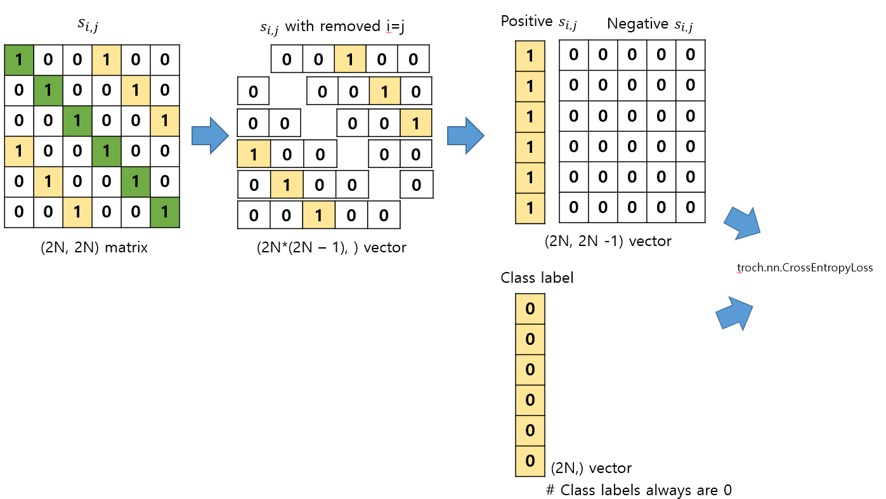

# SimCLR
PyTorch Re-implementation of SimCLR: A Simple Framework for Contrastive Learning of Visual Representations
- Inspried by https://github.com/sthalles/SimCLR


#### Example
1. Build a visual encoder
```python
import torch
import torchvision
from core.models import ResNetEncoder
encoder = ResNetEncoder(out_features=1024)
```

2. Build dataset to get two augmented image pair
```python
import os
import glob

from torchvision.transforms import RandomCrop, GaussianBlur, RandomEqualize, RandomRotation, RandomAffine, Compose, ToTensor
from core.datasets import SimCLRDataSet
from matplotlib import pyplot as plt

images = glob.glob(...)
dataset = SimCLRDataSet(
    images, 
    augmentations=[
        GaussianBlur((3,3)), 
        RandomEqualize(), 
        RandomRotation(degrees=(0, 360)), 
        RandomAffine(degrees=(30, 70), translate=(0.1, 0.3), scale=(0.5, 0.75))
    ],
    transforms=Compose([ToTensor()]),
    device="cuda:1"
)
```

3. Forwarding into the encoder and calculating SimCLR loss
```python
from core.trainer import SimCLRTrainer
from core.loss import SimCLRLoss
dataloder = torch.utils.data.DataLoader(dataset, batch_size=16)
criterion = SimCLRLoss()
trainer = SimCLRTrainer(encoder, criterion)
```

4. Train your model with SimCLRTrainer
```python
optimizer = torch.optim.Adam(encoder.parameters())
trainer = SimCLRTrainer(encoder, optimizer, loss, device=device)
encoder.to(device)
a, b = trainer.run_epoch(dataloder, phase="train", epoch=1)
```


#### Illustration of SimCLR matrix operation
1. Build similarity matrix($s_{i,j}$): similarity between i vector and j vector by visual encoder (2N, 2N)
2. Remove diagonal elements in similarity matrix ($s_{i,j}, i=j$)
3. Split positive samples (key-value) and negtaive samples
4. Concate above two matrix (The 0-th column is alway 0 in this matrix)

